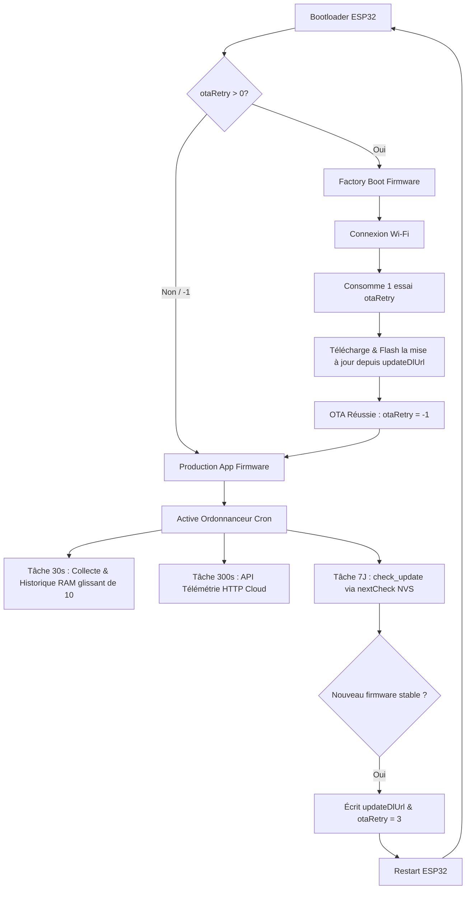

# 👁️ WhisperEye — Firmware ESP32 en Rust

> **WhisperEye** est un firmware industriel modulaire, écrit en **Rust**, conçu pour une carte électronique à base d'**ESP32** (et plus particulièrement optimisé pour l'**ESP32-S3** Xtensa). Grâce à son architecture en *Cargo Workspace*, il sépare rigoureusement la logique réseau de base des orchestrations de capteurs et actionneurs spécifiques à chaque modèle de carte.

---

## 📸 La Carte Électronique WhisperEye

Voici un aperçu visuel de la carte électronique WhisperEye qui héberge ce firmware :

<p align="center">
  
</p>

---

## 🛠️ Architecture Logicielle (Workspace)

Le projet est structuré en **Workspace Cargo** pour garantir une maintenance et une extensibilité maximales :

```text
WhisperEye/
├── common/             # [Library Crate] La base commune réseau & sécurité
│   ├── wifi.rs         # Gestion Wifi (Station + AP) & Bluetooth BLE
│   ├── ntp.rs          # Client de temps SNTP natif
│   ├── ota.rs          # Gestionnaire de mises à jour Over-The-Air sécurisées
│   └── http_server.rs  # Serveur HTTP avec validation TOTP dynamique
└── boards/             # [Binary Crates] Déclinaisons spécifiques aux cartes
    └── board_default/  # Déclinaison de référence (ESP32-S3)
```

### 1. La Base Commune (`common`)
* **OTA Update** : Système de flashage de firmware à distance via double partition active/inactive (`ota_0` et `ota_1`), garantissant un rollback automatique en cas de boot défaillant.
* **Wifi & Bluetooth BLE** : Connexion robuste en mode Station (**SSID par défaut: `IoT` / Pass: `Esp32&Cie2026`**). Si la connexion échoue, la carte bascule automatiquement en mode Point d'Accès (AP) pour permettre une configuration. Initialisation de la pile Bluetooth NimBLE.
* **NTP Client** : Synchronisation précise de l'heure système via SNTP en tâche de fond (**serveur par défaut: `wrt.lan`**).
* **Serveur HTTP & TOTP** : Serveur HTTP ultra-léger (pas de HTTPS pour limiter l'utilisation CPU/RAM) sécurisé par une authentification **TOTP (Time-based One-Time Password)** à 6 chiffres (**secret par défaut: `Totp-Salt-4-Hash-Between-Probe-&-WhisperEye`**).

### 2. Déclinaisons Matérielles (`boards/`)
Selon les déclinaisons de cartes, les modules optionnels suivants sont initialisés :
* 🖥️ **Écran graphique** : Piloté sur bus **SPI** haute vitesse.
* 🚌 **RS485 half-duplex** : Port série de communication industrielle avec contrôle matériel de flux (DE/RTS).
* 📻 **Port Radio** : Pour les transmissions sans fil longue portée (LoRa, RFM95, etc.).
* 🌡️ **Capteurs (Metrics)** :
  * **Roue codeuse et poussoir** de l'écran (navigation fluide dans les menus).
  * **Sensitif périphérique** (entrée tactile capacitive robuste).
  * **Capteur de tension d'alimentation** (mesure de batterie ou tension d'entrée via ADC).
  * **DS18B20** via bus 1-Wire.
  * **SCD41** (CO2/Temp/Humidité) & **SHT45** (Haute précision Temp/Humidité) sur bus **I2C**, multiplexés derrière un switch **TCA9548A**.
* ⚙️ **Actionneurs (Cmd)** :
  * 2x **Relais de puissance**.
  * 1x **Moteur double sens** ou 2x **sorties PWM** de précision.
  * 2x **LEDs d'état** de diagnostic (clignotement alterné heartbeat).
  * 1x **Pin sectionneur d'alimentation** (gestion avancée de la consommation et sécurité).

---

## 🔄 Mécanismes Clés & Cycle de Vie du Système

WhisperEye intègre plusieurs briques logicielles avancées et imbriquées pour assurer la résilience industrielle de la carte électronique :



### 1. Structure de Partitions & Double Boot (`partitions.csv`)
Pour éviter tout risque de "brick" matériel en production, la mémoire flash de 4 Mo est séparée en plusieurs partitions :
* **`factory` (1.9 Mo)** : Contient le firmware de secours autonome (`factory_boot`). Il héberge un portail captif mobile de secours, gère le flashage de fichiers `.bin` glissés-déposés, et exécute de manière blindée la phase d'application d'une mise à jour OTA.
* **`production` (1.9 Mo)** : Contient le firmware applicatif principal de production (`production_app`) avec la logique capteur, l'ordonnanceur et le dashboard de monitoring.
* **`otadata` (8 Ko)** : Coordonne la table de boot de l'ESP32.
* **`nvs` (24 Ko)** : La base NVS stocke de façon permanente les configurations Wi-Fi, le cache des réseaux connus (`wifiKnown`), les cibles temporelles de planification (`nextCheck`), et les drapeaux d'OTA.

### 2. Ordonnanceur de Tâches Périodiques Découplé (`cron.rs`)
La gestion des tâches d'arrière-plan de l'application de production est déléguée à un **système de boucle à messages isolée (Worker Pattern)** :
* **Découplage strict** : Un thread générateur envoie des signaux *Tick* toutes les secondes sur un canal `std::sync::mpsc::channel`. Un Worker dans un thread dédié dépile ces messages de façon asynchrone, éliminant tout blocage de l'interface ou conflits de accès concurrents (Mutex).
* **Tâche 30 secondes** : Collecte les relevés sensoriels réels (SHT45, SCD41, DS18B20) et maintient en mémoire RAM un **historique glissant des 10 dernières mesures**. Cet historique est servi de façon ultra-réactive via l'API locale `GET /api/history`.
* **Tâche 300 secondes** : Déclenche un envoi simulé de télémétrie HTTP POST vers le cloud.
* **Tâche 7 Jours (Contre les Dérives)** : Pour prévenir toute dérive liée au redémarrage ou à l'extinction de la carte, WhisperEye n'utilise pas de simple compteur de secondes en RAM. Il stocke une date cible en NVS (`nextCheck`). Toutes les minutes, il compare le temps réel NTP (synchronisé au démarrage via SNTP) à cette cible. Dès que l'échéance est atteinte, le firmware exécute un `check_update()` automatique, puis décale la cible NVS de `N + 7 jours`.

### 3. Proxy de Mise à Jour CORS-Bypass (`/api/check_updates`)
Lorsqu'un utilisateur clique sur "Vérifier maintenant" sur le dashboard web de WhisperEye, le navigateur interroge l'ESP32 via `/api/check_updates`. 
* **Le problème CORS** : Les navigateurs modernes bloquent le téléchargement direct du fichier de catalogue `firmware.json` sur GitHub en raison des politiques de sécurité CORS (Cross-Origin Resource Sharing).
* **La solution WhisperEye** : L'ESP32 sert lui-même de proxy. Il lit l'URL `updateAvailable` configurée en NVS, effectue le téléchargement HTTP en interne sur le réseau, filtre le JSON pour extraire **uniquement** l'entrée correspondant au matériel (`boardType: "v1.0"`, `ChipType: "ESP32"`), et retourne cet objet unique au client. Cela économise la RAM de l'ESP32 et élimine les erreurs CORS à 100%.

### 4. Cycle d'OTA Sécurisé & Anti-Bootloop (`otaRetry`)
Lorsqu'une nouvelle version stable de firmware est détectée (au boot automatique ou manuellement) :
1. L'URL directe du binaire applicatif `.bin` est inscrite dans `updateDlUrl` en NVS.
2. Le compteur de tentatives d'OTA `otaRetry` est configuré à `3` en NVS.
3. L'ESP32 redémarre instantanément en partition de secours `factory_boot`.
4. Au boot, `factory_boot` se connecte au Wi-Fi. S'il détecte `otaRetry > 0`, **il décrémente immédiatement de 1 le compteur dans le NVS** avant tout téléchargement.
5. Si un bug réseau ou une coupure d'alimentation survient en plein milieu du flashage, l'ESP32 redémarrera. La tentative suivante reprendra avec `otaRetry` décrémenté, évitant un cycle de redémarrage infini en cas de binaire corrompu.
6. Une fois le flashage réussi, `otaRetry` repasse à `-1`, et la carte bascule et démarre sur son nouveau système de production mis à jour !

---

## 🚀 Guide de Démarrage Rapide

### 1. Prérequis Système
Pour compiler du Rust pour ESP32, vous devez installer la chaîne de compilation croisée d'Espressif.

#### Étape A : Installer `espup` (le gestionnaire d'outils d'Espressif)
```bash
# Windows (PowerShell)
iwr -useb https://github.com/esp-rs/espup/releases/latest/download/espup-x86_64-pc-windows-msvc.zip -OutFile espup.zip
Expand-Archive espup.zip -DestinationPath .
.\espup.exe install
```

#### Étape B : Installer les utilitaires de flashage
```bash
cargo install ldproxy
cargo install cargo-espflash
```

---

### 2. Compilation du Projet

Pour compiler la déclinaison par défaut de la carte (cible **ESP32-S3** Xtensa) :

```bash
# Aller dans le dossier du binaire de la carte
cd boards/board_default

# Compiler en mode Release
cargo build --release
```

Pour compiler pour une autre cible (ex: ESP32-C6 RISC-V, ESP32 classique) :
Vous pouvez changer la variable `MCU` et la cible `target` dans le fichier `boards/board_default/.cargo/config.toml` ou passer l'argument de compilation :
```bash
cargo build --release --target riscv32imac-unknown-none-elf
```

---

### 3. Flashage et Monitoring

Connectez votre carte WhisperEye en USB, puis lancez le flashage et le moniteur de logs série :

```bash
# Flasher le binaire compilé sur la carte
cargo espflash flash --release --monitor
```

---

## 🔒 Configuration de la Sécurité (TOTP)

Par défaut, le secret TOTP de WhisperEye est défini dans `common/src/lib.rs`. Pour générer des codes TOTP valides :
1. Copiez la clé secrète par défaut : `Totp-Salt-4-Hash-Between-Probe-&-WhisperEye` (ou configurez la vôtre).
2. Ajoutez-la dans votre application d'authentification favorite (Google Authenticator, Bitwarden, Aegis, 2FAS, etc.).
3. Connectez-vous au Wifi de la carte, naviguez sur `http://<IP_DE_LA_CARTE>/` et saisissez le code à 6 chiffres affiché par votre application.

---

## 📜 Licence

Ce projet est sous licence propriétaire. Tous droits réservés à **Sctfic**.
