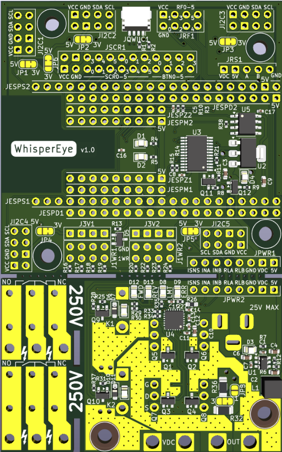

# 👁️ WhisperEye — Firmware ESP32 en Rust

> **WhisperEye** est un firmware industriel modulaire, écrit en **Rust**, conçu pour une carte électronique à base d'**ESP32** (et plus particulièrement optimisé pour l'**ESP32-S3** Xtensa). Grâce à son architecture en *Cargo Workspace*, il sépare rigoureusement la logique réseau de base des orchestrations de capteurs et actionneurs spécifiques à chaque modèle de carte.

---

## 📸 La Carte Électronique WhisperEye

Voici un aperçu visuel de la carte électronique WhisperEye qui héberge ce firmware :

<p align="center">
  
</p>

---

## 🛠️ Architecture Logicielle (Workspace)

Le projet est structuré en **Workspace Cargo** pour garantir une maintenance et une extensibilité maximales :

```text
WhisperEye/
├── common/             # [Library Crate] La base commune réseau & sécurité
│   ├── wifi.rs         # Gestion Wifi (Station + AP) & Bluetooth BLE
│   ├── ntp.rs          # Client de temps SNTP natif
│   ├── ota.rs          # Gestionnaire de mises à jour Over-The-Air sécurisées
│   └── http_server.rs  # Serveur HTTP avec validation TOTP dynamique
└── boards/             # [Binary Crates] Déclinaisons spécifiques aux cartes
    └── board_default/  # Déclinaison de référence (ESP32-S3)
```

### 1. La Base Commune (`common`)
* **OTA Update** : Système de flashage de firmware à distance via double partition active/inactive (`ota_0` et `ota_1`), garantissant un rollback automatique en cas de boot défaillant.
* **Wifi & Bluetooth BLE** : Connexion robuste en mode Station (**SSID par défaut: `IoT` / Pass: `Esp32&Cie2026`**). Si la connexion échoue, la carte bascule automatiquement en mode Point d'Accès (AP) pour permettre une configuration. Initialisation de la pile Bluetooth NimBLE.
* **NTP Client** : Synchronisation précise de l'heure système via SNTP en tâche de fond (**serveur par défaut: `wrt.lan`**).
* **Serveur HTTP & TOTP** : Serveur HTTP ultra-léger (pas de HTTPS pour limiter l'utilisation CPU/RAM) sécurisé par une authentification **TOTP (Time-based One-Time Password)** à 6 chiffres (**secret par défaut: `Totp-Salt-4-Hash-Between-Probe-&-WhisperEye`**).

### 2. Déclinaisons Matérielles (`boards/`)
Selon les déclinaisons de cartes, les modules optionnels suivants sont initialisés :
* 🖥️ **Écran graphique** : Piloté sur bus **SPI** haute vitesse.
* 🚌 **RS485 half-duplex** : Port série de communication industrielle avec contrôle matériel de flux (DE/RTS).
* 📻 **Port Radio** : Pour les transmissions sans fil longue portée (LoRa, RFM95, etc.).
* 🌡️ **Capteurs (Metrics)** :
  * **Roue codeuse et poussoir** de l'écran (navigation fluide dans les menus).
  * **Sensitif périphérique** (entrée tactile capacitive robuste).
  * **Capteur de tension d'alimentation** (mesure de batterie ou tension d'entrée via ADC).
  * **DS18B20** via bus 1-Wire.
  * **SCD41** (CO2/Temp/Humidité) & **SHT45** (Haute précision Temp/Humidité) sur bus **I2C**, multiplexés derrière un switch **TCA9548A**.
* ⚙️ **Actionneurs (Cmd)** :
  * 2x **Relais de puissance**.
  * 1x **Moteur double sens** ou 2x **sorties PWM** de précision.
  * 2x **LEDs d'état** de diagnostic (clignotement alterné heartbeat).
  * 1x **Pin sectionneur d'alimentation** (gestion avancée de la consommation et sécurité).

---

## 🚀 Guide de Démarrage Rapide

### 1. Prérequis Système
Pour compiler du Rust pour ESP32, vous devez installer la chaîne de compilation croisée d'Espressif.

#### Étape A : Installer `espup` (le gestionnaire d'outils d'Espressif)
```bash
# Windows (PowerShell)
iwr -useb https://github.com/esp-rs/espup/releases/latest/download/espup-x86_64-pc-windows-msvc.zip -OutFile espup.zip
Expand-Archive espup.zip -DestinationPath .
.\espup.exe install
```

#### Étape B : Installer les utilitaires de flashage
```bash
cargo install ldproxy
cargo install cargo-espflash
```

---

### 2. Compilation du Projet

Pour compiler la déclinaison par défaut de la carte (cible **ESP32-S3** Xtensa) :

```bash
# Aller dans le dossier du binaire de la carte
cd boards/board_default

# Compiler en mode Release
cargo build --release
```

Pour compiler pour une autre cible (ex: ESP32-C6 RISC-V, ESP32 classique) :
Vous pouvez changer la variable `MCU` et la cible `target` dans le fichier `boards/board_default/.cargo/config.toml` ou passer l'argument de compilation :
```bash
cargo build --release --target riscv32imac-unknown-none-elf
```

---

### 3. Flashage et Monitoring

Connectez votre carte WhisperEye en USB, puis lancez le flashage et le moniteur de logs série :

```bash
# Flasher le binaire compilé sur la carte
cargo espflash flash --release --monitor
```

---

## 🔒 Configuration de la Sécurité (TOTP)

Par défaut, le secret TOTP de WhisperEye est défini dans `common/src/lib.rs`. Pour générer des codes TOTP valides :
1. Copiez la clé secrète par défaut : `Totp-Salt-4-Hash-Between-Probe-&-WhisperEye` (ou configurez la vôtre).
2. Ajoutez-la dans votre application d'authentification favorite (Google Authenticator, Bitwarden, Aegis, 2FAS, etc.).
3. Connectez-vous au Wifi de la carte, naviguez sur `http://<IP_DE_LA_CARTE>/` et saisissez le code à 6 chiffres affiché par votre application.

---

## 📜 Licence

Ce projet est sous licence propriétaire. Tous droits réservés à **Sctfic**.
