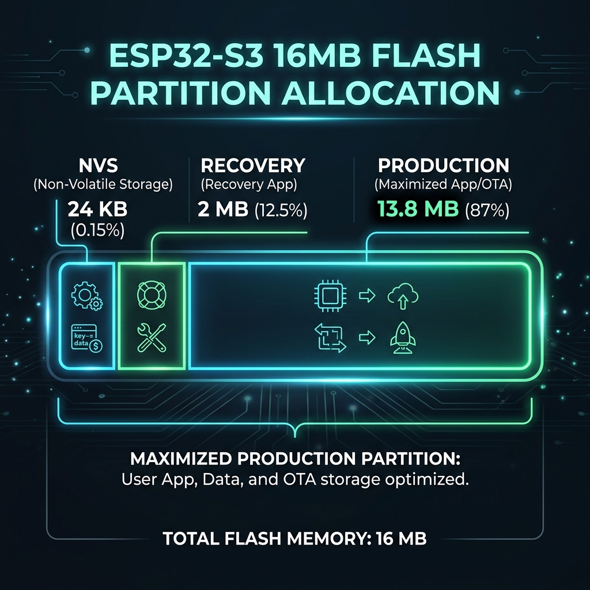
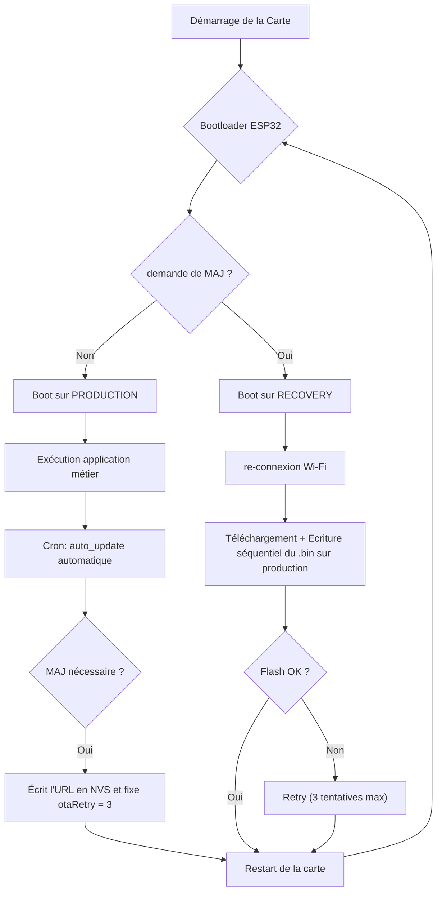
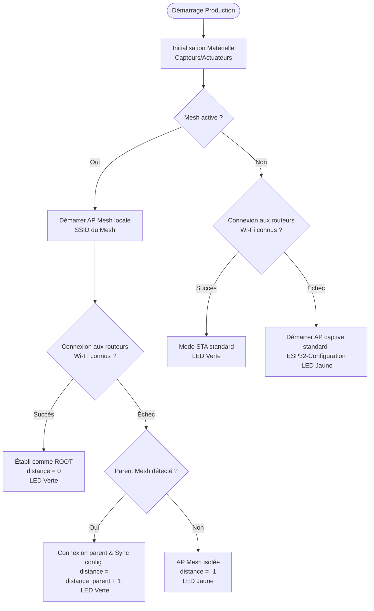
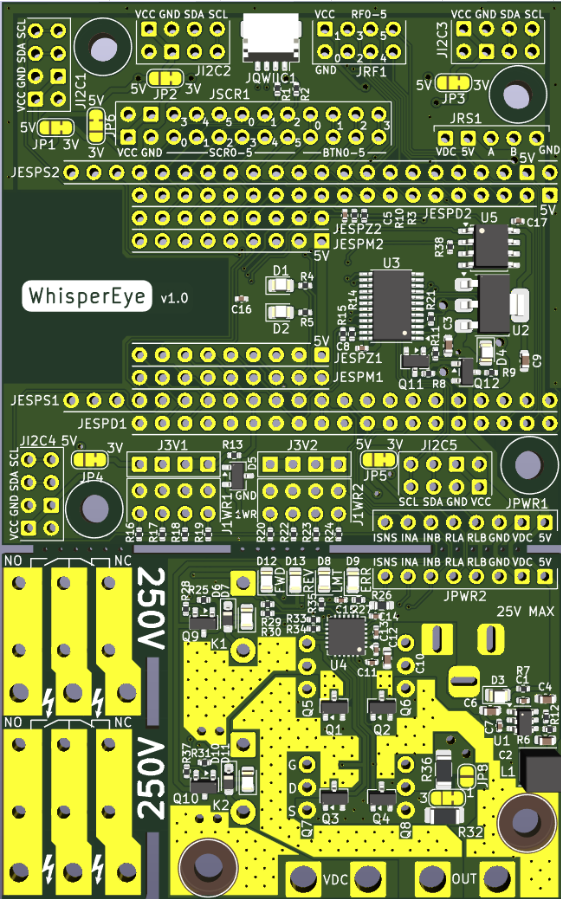
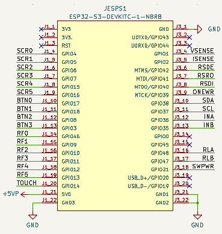
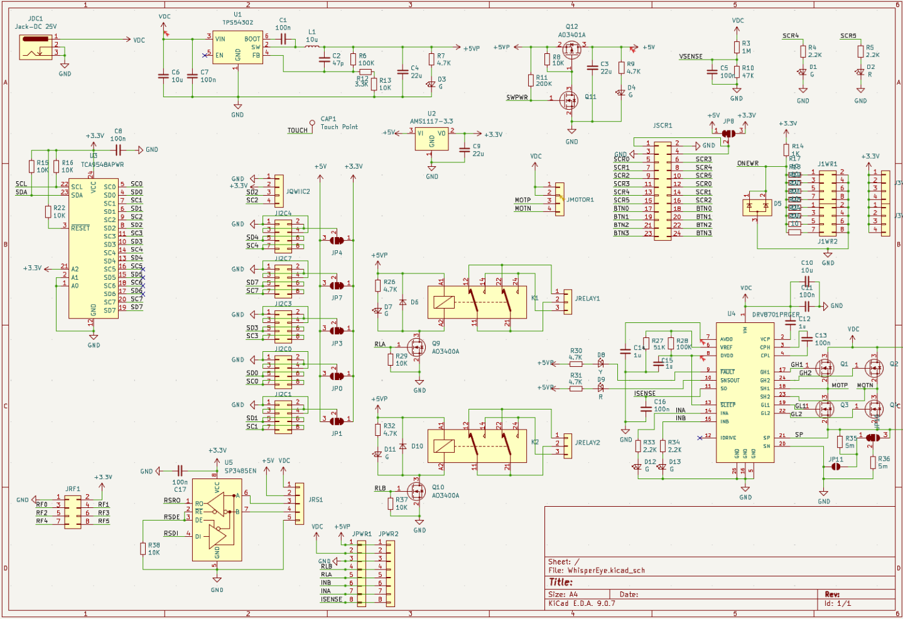
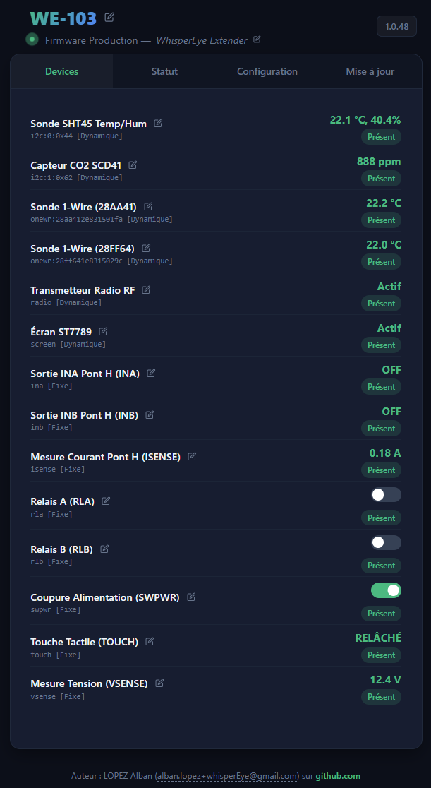
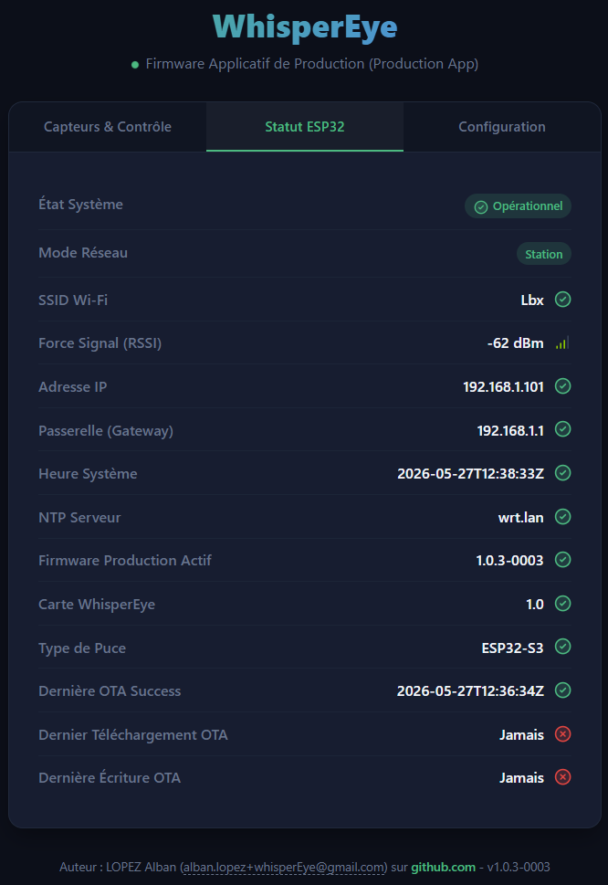
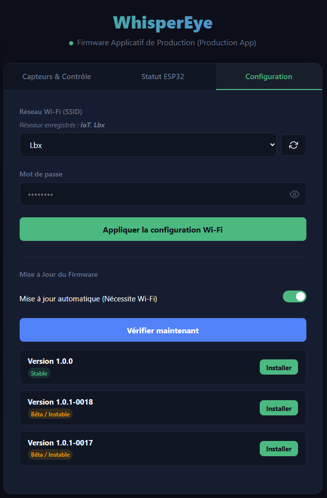
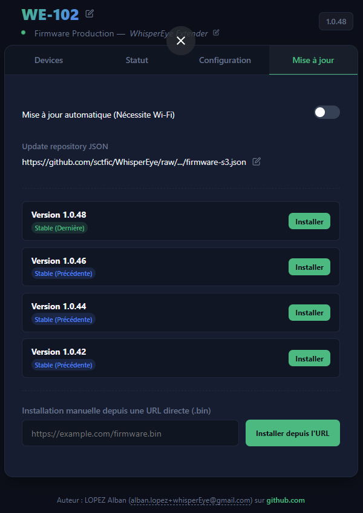

# 👁️ WhisperEye — Système de Partitionnement & Mise à Jour OTA (Rust / ESP32)

> **WhisperEye** est un écosystème de firmware modulaire écrit en **Rust** pour microcontrôleurs Espressif (**ESP32-S3**). Il s'appuie sur une séparation stricte entre une partition de secours stable (**Recovery**) et une partition applicative métier (**Production**). Ce modèle garantit une résilience industrielle avec mise à jour automatisée Over-The-Air (OTA) et un mécanisme anti-bootloop.

---

## 💾 Architecture de Partitionnement (`partitions.csv`)

Pour éviter tout risque de blocage ou d'inaccessibilité en production, la mémoire flash de 16 Mo de la carte WhisperEye est organisée selon un schéma de partitionnement spécifique défini dans le fichier [partitions.csv](./partitions.csv) :

```text
+--------------------------------------------------------------------------------+
|                                 ESP32-S3 Flash (16 Mo)                         |
+------------+---------------+--------------+---------------+--------------------+
| nvs (24K)  | otadata (8K)  | phy_init (4K)| recovery (2M) | production (13.8M) |
| Config/WiFi| Table de Boot | Phys RF Init |  Sub:factory  |        App         |
+------------+---------------+--------------+---------------+--------------------+
```



> [!TIP]
> **Optimisation de l'espace disponible** : Cette répartition asymétrique de la mémoire flash est spécifiquement conçue pour maximiser l'espace disponible pour le firmware applicatif de Production (`production_app` à 13.8 Mo). La partition `recovery_boot` est quant à elle minimisée à 2 Mo et la NVS à 24 Ko. Cette structure garantit que les fonctionnalités complexes (capteurs, base de données locale d'historique, interface web premium) disposent de toute la mémoire nécessaire sans compromettre la présence d'une solution de secours autonome en cas de panne de démarrage.


### Rôle détaillé des partitions :
* **`nvs` (24 Ko)** : Stockage non volatile. Elle contient les identifiants réseaux mémorisés dans le dictionnaire `wifiKnown`, le drapeau `autoUpdate` (activant/désactivant la mise à jour automatique), l'URL du dépôt de mise à jour `updateAvailable`, le compteur de tentatives de boot `otaRetry` (permettant de se prémunir des mises à jour infinies en boucle en cas de binaire défaillant), et la date cible du prochain contrôle `nextCheck`.
* **`otadata` (8 Ko)** : Coordonne la table de démarrage (boot slot active). L'ESP32 l'utilise pour décider de démarrer sur la partition de production ou de secours.
* **`phy_init` (4 Ko)** : Contient les données d'initialisation pour la couche physique radio (Wi-Fi et Bluetooth).
* **`recovery` (2 Mo)** : Contient le firmware de secours autonome `recovery_boot`.
* **`production` (13.8 Mo)** : Dédiée à l'application métier principale `production_app`. Elle dispose de l'espace de stockage maximal pour héberger la logique des capteurs, l'ordonnanceur Cron, l'historique glissant des mesures et le dashboard web.
  > [!IMPORTANT]
  > Bien que nommée **`recovery`** dans la configuration, son sous-type (subtype) dans la table reste défini sur `factory`. Cela force le bootloader de l'ESP32 à l'utiliser comme fallback automatique en cas de défaillance de démarrage. Ce binaire de secours n'est jamais mis à jour par OTA.


---

## 🔄 Principe de Fonctionnement (Production vs Recovery)

WhisperEye utilise un cycle de démarrage bidirectionnel sécurisé pour déployer de nouvelles versions de firmware sans intervention physique sur l'appareil.


```mermaid
graph TD
    A[Démarrage de la Carte] --> B{Bootloader ESP32}
    B --> C{demande de MAJ ?}
    C -- "Oui" --> D[Boot sur RECOVERY]
    C -- "Non" --> E[Boot sur PRODUCTION]

    E --> E1[Exécution application métier]
    E1 --> E2[Cron: auto_update automatique]
    E2 --> E3{MAJ nécessaire ?}
    E3 -- Oui --> E4[Écrit l'URL en NVS et fixe otaRetry = 3]
    E4 --> E5[Restart de la carte]
    E5 --> B

    D --> D1[re-connexion Wi-Fi]
    D1 --> D3[Téléchargement + Ecriture séquentiel du .bin sur production]
    D3 --> D4{Flash OK ?}
    D4 -- "Oui" --> E5
    D4 -- "Non" --> D6["Retry (3 tentatives max)"]
    D6 --> E5

```

### 1. Mode Normal (Production)
Par défaut, la carte démarre et s'exécute sur le firmware `production_app`. Elle récolte les données de capteurs, gère les 10 dernières mesures d'historique en mémoire, et expose un dashboard moderne et l'API. Elle exécute aussi les cron en tâche de fond :
- collecter les données de mesures (30 sec, 3 mesures)
- envoyer les données de mesures (5 minutes, 10 mesures)
- vérifier la présence de nouvelles versions sur le dépôt distant (tous les samedis à 12h00)

#### 📶 Séquence d'initialisation Wi-Fi & Mesh au démarrage (Production) :
Lors du démarrage de la partition de production, le système applique la séquence suivante :


```mermaid
graph TD
    Start([Démarrage Production]) --> InitHardware[Initialisation Matérielle <br> Capteurs/Actuateurs]
    InitHardware --> CheckMesh{Mesh activé ?}
    
    CheckMesh -- Oui --> StartMeshAP[Démarrer AP Mesh locale <br> SSID du Mesh]
    StartMeshAP --> TryKnownSTA{Connexion aux routeurs <br> Wi-Fi connus ?}
    
    TryKnownSTA -- Succès --> SetRoot[Établi comme ROOT <br> distance = 0 <br> LED Verte]
    TryKnownSTA -- Échec --> ScanParent{Parent Mesh détecté ?}
    
    ScanParent -- Oui --> ConnectParent[Connexion parent & Sync config <br> distance = distance_parent + 1 <br> LED Verte]
    ScanParent -- Non --> SetAPOnly[AP Mesh isolée <br> distance = -1 <br> LED Jaune]
    
    CheckMesh -- Non --> TrySTACap{Connexion aux routeurs <br> Wi-Fi connus ?}
    TrySTACap -- Succès --> SetSTADirect[Mode STA standard <br> LED Verte]
    TrySTACap -- Échec --> StartAPCaptive[Démarrer AP captive standard <br> ESP32-Configuration <br> LED Jaune]
```

1. **Initialisation Matérielle** : Chargement des périphériques et capteurs.
2. **Si le Mesh est activé (`mesh_enabled`)** :
   * **Démarrage de l'AP Mesh** : L'AP locale démarre instantanément sur le SSID du Mesh (`meshId`) pour permettre aux clients de s'y connecter immédiatement (adresse IP `192.168.71.1`).
   * **Tentative STA sur réseaux connus** : Le nœud tente de se connecter en tant que client (STA) sur les réseaux Wi-Fi connus (SSID par défaut puis les autres successivement).
     * *Succès* : Le nœud s'établit comme **Root** (`distance = 0`), la LED passe au **Vert**.
     * *Échec* : L'appareil cherche un parent Mesh avec le même `meshId`. S'il est trouvé, il s'y connecte pour synchroniser sa configuration via `/api/mesh/sync`. Le nœud devient secondaire (`distance = distance_parent + 1`).
     * *Échec global* : L'AP Mesh reste active seule pour administration directe (`distance = -1`), la LED passe au **Jaune**.
3. **Si le Mesh est désactivé** :
   * Tentative de connexion client STA sur les réseaux Wi-Fi de la NVS.
   * En cas d'échec global, ouverture de l'AP captive locale (`ESP32-Configuration`, LED Jaune).

### 2. sequence d'update (via `[Recovery]`)
  > [!IMPORTANT]
  > Il n'est pas possible d'uploader un firmware directement depuis la partition de `[Production]`, seulement depuis `[Recovery]`

Si une mise à jour est initiée :
1. `[Production]` écrit l'URL du fichier binaire dans la NVS, Et demande 3 tentatives de mise à jour.
2. L'ESP32-S3 redémarre instantanément surs `[Recovery]`.
3. **Transition et Suivi de Progression** : Pendant que la carte redémarre et se flashe, le frontend de `[production]` (déjà chargé dans le navigateur de l'utilisateur) affiche un écran de progression et **interroge en boucle (polling)** l'API `/api/updateStatus`. Comme la partition `[Recovery]` prend le relais sur la même adresse IP, c'est elle qui répond de manière transparente au frontend pour afficher la progression en temps réel (pourcentage, octets écrits).
4. Dès son chargement, le firmware de secours se reconnecte au Wi-Fi. Avant de commencer tout téléchargement réseau, **il décrémente immédiatement de 1 le compteur `otaRetry` en NVS** Pour éviter tes tentatives de mise à jour en boucle.
5. Il télécharge le nouveau firmware applicatif et le flashe sur la partition `[production]` tout en rapportant son statut via l'API de progression.
6. Si l'installation réussit, la carte redémarre sur son nouveau firmware de `[production]`. Le frontend détecte ce redémarrage final et recharge la page principale.
7. Si l'installation échoue à 3 reprises, la carte reste indéfiniment en mode `[Recovery]`. L'utilisateur peut alors utiliser l'interface web `[Recovery]` pour diagnostiquer le système, uploader manuellement un binaire ou corriger les configurations.

---

## 🛠️ Architecture Logicielle (Workspace)

Le projet utilise un espace de travail Rust (Cargo Workspace) divisé de manière modulaire :

```text
WhisperEye/
├── Cargo.toml                  # Fichier de configuration du Workspace Cargo
├── partitions.csv              # Table des partitions de flashage (ESP32-S3)
├── run.ps1                     # Script de compilation & téléversement (PowerShell)
├── common/                     # [Crate commune] Partagée par Recovery et Production
│   └── src/
│       ├── lib.rs              # Modèles et clés NVS
│       └── nvs_storage.rs      # Wrapper d'accès en lecture/écriture à la NVS
├── recovery_boot/              # [Crate de secours] Firmware Recovery autonome (2 Mo)
│   └── src/
│       ├── main.rs             # Bootloader de secours, serveur HTTP & flashage OTA
│       ├── recovery.html       # Tableau de bord minimaliste de secours
│       ├── web_pages.rs        # Embarquement des ressources HTML
│       └── wifi.rs             # Gestion Wi-Fi et DNS Captif de secours
├── production_app/             # [Crate applicative] Firmware Production principal (13.8 Mo)
│   ├── Cargo.toml
│   ├── src/
│   │   ├── main.rs             # Dashboard, API REST locale & Initialisations
│   │   ├── production.html     # Tableau de bord dynamique moderne
│   │   ├── web_pages.rs        # Embarquement des ressources HTML de production
│   │   ├── wifi.rs             # Gestion Wi-Fi de production (Wi-Fi connus)
│   │   ├── cron.rs             # Tâches périodiques (Mises à jour, SNTP, Télémétrie)
│   │   ├── sensors.rs          # Routines de lecture des capteurs (I2C, 1-Wire, ADC)
│   │   └── actuators.rs        # Contrôle des sorties (Relais, PWM, LEDs)
│   └── schema.png              # Schéma électronique de principe
└── boards/                     # [Configurations de cartes cibles]
    ├── board_default/
    │   └── firmware.json       # Catalogue JSON décrivant les versions de firmware disponibles
    └── ota_base/
```

---

## 🔌 Carte Électronique WhisperEye

Le système tourne sur une carte matérielle propriétaire basée sur la puce **ESP32-S3**.

### Aperçus de la carte :

| Visuel Physique | Plan Mécanique |
|:---:|:---:|
|  |  |

* **Schéma Électronique** :
  
* **Brochage complet de la carte** (détail du fichier [S3-pin.tsv](./production_app/S3-pin.tsv)) :

| Signal / Label | GPIO (ESP32-S3) | Description |
|:---|:---:|:---|
| **ONEWR** | 39 | Bus 1-Wire (connecteurs 2x5) |
| **ISENSE** | 2 | Mesure de courant du pont en H |
| **SCR0** | 4 | Écran SLC (ST7789) |
| **SCR1** | 5 | Écran SDA (ST7789) |
| **SCR2** | 6 | Écran RES (ST7789) |
| **SCR3** | 7 | Écran DC (ST7789) |
| **SCR4** | 15 | Écran CS (ST7789) |
| **SCR5** | 16 | Écran BLK (ST7789) - Rétroéclairage |
| **BTN0** | 17 | Codeur rotatif - Roue sens A (EC11) |
| **BTN1** | 18 | Codeur rotatif - Roue sens B (EC11) |
| **BTN2** | 8 | Codeur rotatif - Bouton poussoir (EC11) |
| **BTN3** | 3 | Bouton de secours (Bouton KO) |
| **RSRO** | 41 | Liaison RS485 (SP3485EN) - RO (Receive Output) |
| **RSDE** | 42 | Liaison RS485 (SP3485EN) - DE (Driver Enable / RTS) |
| **RSDI** | 40 | Liaison RS485 (SP3485EN) - DI (Driver Input) |
| **SDA** | 38 | Bus I2C - SDA (Multiplexeur TCA9548A) |
| **SCL** | 37 | Bus I2C - SCL (Multiplexeur TCA9548A) |
| **INA** | 36 | Contrôle moteur - Entrée A du pont en H (DRV8701) |
| **INB** | 35 | Contrôle moteur - Entrée B du pont en H (DRV8701) |
| **RLA** | 48 | Relais de puissance A |
| **RLB** | 47 | Relais de puissance B |
| **VSENSE** | 1 | Mesure de la tension d'alimentation générale |
| **TOUCH** | 14 | Touche tactile capacitive périphérique |
| **SWPWR** | 21 | Sectionneur d'alimentation (coupure des rails 5V et 3.3V, sauf ESP) |
| **RF0** | 46 | Module radio (connecteur RF) |
| **RF1** | 9 | Module radio (connecteur RF) |
| **RF2** | 10 | Module radio (connecteur RF) |
| **RF3** | 11 | Module radio (connecteur RF) |
| **RF4** | 12 | Module radio (connecteur RF) |
| **RF5** | 13 | Module radio (connecteur RF) |


### Caractéristiques principales de la carte :
* **Microcontrôleur** : ESP32-S3 (Xtensa LX7 double cœur à 240 MHz).
* **Bus d'affichage (SPI)** : Support d'écran graphique haute résolution piloté par bus SPI rapide.
* **Bus Capteurs (I2C & 1-Wire)** :
  - Capteur de CO2, température et humidité **SCD41** et sonde haute précision **SHT45** multiplexés sur bus I2C via le circuit **TCA9548A**.
  - Sonde de température déportée **DS18B20** via bus 1-Wire.
  - Entrées tactiles (touches capacitives sensitives).
* **Communication industrielle** : Ligne série **RS485 half-duplex** avec contrôle matériel de direction (DE/RTS).
* **Alimentation & Actionneurs** :
  - Entrée d'alimentation de mesure (ADC) pour surveiller le niveau d'alimentation global.
  - Interrupteur/sectionneur d'alimentation général géré par pin GPIO pour les phases d'économie d'énergie.
  - Relais de puissance et sorties PWM moteur de précision.

---

## 🖥️ Interfaces Web (Dashboard)

Les firmware Production et Recovery intègrent tous deux des interfaces web embarquées très performantes écrites en HTML / CSS / Vanilla JS.

   

* **Interface Production (`production.html`)** : Dashboard de monitoring premium avec affichage dynamique des métriques (CO2, Température, Humidité), graphique d'historique glissant, état des relais et moteurs avec commande en temps réel, panneau de configuration réseau WiFi (SSID, mot de passe) et module d'installation de firmware OTA.
* **Interface Recovery (`recovery.html`)** : Interface simplifiée (sans les capteurs ni actionneurs) et de secours. Elle permet d'uploader directement un binaire de production compilé localement en glisser-déposer (Drag & Drop), de configurer les réseaux connus, et de forcer manuellement le téléchargement d'un binaire depuis une URL.

---

## 🚀 Guide de Personnalisation pour Développeur

Pour adapter le firmware WhisperEye à votre propre projet ou carte électronique, suivez ces étapes :

### 1. Conserver `[Recovery]` et Personnaliser `[Production]`
Le firmware de secours `recovery_boot` est conçu pour rester générique et ne doit pas être modifié afin de préserver votre filet de sécurité (rollback). Vous devez implémenter vos fonctionnalités dans `production_app`.

### 2. Configurer le BoardType et le ChipType
Ouvrez le fichier `production_app/src/main.rs` et mettez à jour les constantes suivantes en haut du fichier (Elles devront correspondre au `firmware.json`. )
```rust
const WHISPEREYE_BOARD:  &str = "2.0";       // Version ou type de votre carte électronique boardType
const CHIP_TYPE:  &str = "ESP32-S3";         // Type du microcontrôleur cible (ex: ESP32-S3, ESP32-C6) ChipType
```

### 3. Configurer le Serveur de Mise à Jour OTA
Le firmware de production interroge régulièrement l'URL stockée dans la NVS sous la clé `updateAvailable`. Le fichier ciblé par cette URL doit respecter la structure JSON attendue.

Pour déployer vos firmwares, créez un fichier JSON similaire à [firmware-s3.json](./boards/board_default/firmware-s3.json) sur votre serveur d'hébergement :
```json
  {
    "ChipType": "ESP32-S3",
    "stable": [
      {
        "version": "1.0.0",
        "url": "https://votre-domaine.com/assets/firmware-s3-1.0.0.bin"
      }
    ],
    "unstable": [
      {
        "version": "1.0.1-0002",
        "url": "https://votre-domaine.com/assets/firmware-s3-1.0.1-0002.bin"
      }
    ]
  }
```
### 4. Enregistrer la Clé `updateAvailable` dans la NVS
Modifier les valeurs par défaut dans le fichier `common/src/nvs_storage.rs`.

---

## 🛠️ Compilation et Téléversement

La chaîne de compilation Rust pour ESP32 nécessite des outils spécifiques d'Espressif.

### 1. Prérequis Système Généraux
1. Installez le compilateur Rust : [rustup](https://rustup.rs/).
2. Installez la toolchain ESP32 et les compilateurs croisés :
   ```bash
   cargo install ldproxy
   cargo install cargo-espflash
   ```
3. Installez `espup` pour gérer automatiquement les dépendances et compilateurs C++ Xtensa nécessaires à `esp-idf-sys` :
   ```bash
   # Installation globale de espup
   cargo install espup
   espup install
   ```

---

### 2. Déploiement sur Windows (Recommandé)

Sous Windows, le script d'automatisation [run.ps1](./run.ps1) gère l'export de l'environnement, l'incrémentation des versions, la compilation et le flashage.

1. Ouvrez une console **PowerShell** standard.
2. Lancez la compilation et le flashage d'un composant spécifique :

```powershell
# compiler et flasher l'intégralité du système (Recovery + Production)
.\run.ps1 -Target all

# compiler et flasher uniquement le firmware applicatif de Production
.\run.ps1 -Target production

# compiler et flasher uniquement le firmware de secours Recovery
.\run.ps1 -Target recovery

# effacer complètement la partition NVS de la carte
.\run.ps1 -Target nvs

# spécifier un port COM spécifique
.\run.ps1 -Target production -Port COM4
```

---

### 3. Déploiement sur Linux (Manuel / Ligne de Commande)

> [!NOTE]
> Les scripts de compilation automatique ne sont pas encore testés sous Linux. Vous pouvez compiler et flasher manuellement à l'aide des commandes standard de Cargo.

#### Prérequis Linux (Debian/Ubuntu) :
Installez les bibliothèques système nécessaires pour la communication USB série et la compilation croisée :
```bash
sudo apt-get update
sudo apt-get install -y libudev-dev pkg-config libusb-1.0-0-dev python3 python3-pip
```

#### Commandes de compilation :
```bash
# Charger les variables d'environnement espup (typiquement générées par espup install)
. $HOME/export-esp.sh

# Compiler le binaire Recovery (Secours)
cargo +esp build --package recovery_boot --release

# Compiler le binaire Production (Applicatif)
cargo +esp build --package production_app --release
```

#### Commandes de flashage manuel :
```bash
# Flasher le firmware de secours Recovery (sans rebooter après flash)
cargo +esp espflash flash --flash-size 16mb --package recovery_boot --partition-table partitions.csv --target-app-partition recovery --release --after no-reset

# Flasher le firmware de Production et ouvrir le moniteur série
cargo +esp espflash flash --flash-size 16mb --package production_app --partition-table partitions.csv --target-app-partition production --release --monitor
```

---

## Licence

Ce projet est distribué sous la licence **PolyForm Noncommercial License 1.0.0**.

* **Usage Non-Commercial** : L'utilisation, la modification et la distribution du code sont entièrement gratuites pour des projets personnels, éducatifs, de recherche ou de loisir (hobby).
* **Usage Commercial** : Toute exploitation commerciale, directe ou indirecte, est interdite sans accord écrit. Pour toute utilisation commerciale, veuillez contacter l'auteur pour obtenir une licence :
  * **Auteur** : LOPEZ Alban
  * **Email** : [alban.lopez+whisperEye@gmail.com](mailto:alban.lopez+whisperEye@gmail.com)

Pour consulter l'intégralité des termes juridiques de la licence, veuillez vous référer au fichier [LICENSE](./LICENSE).
